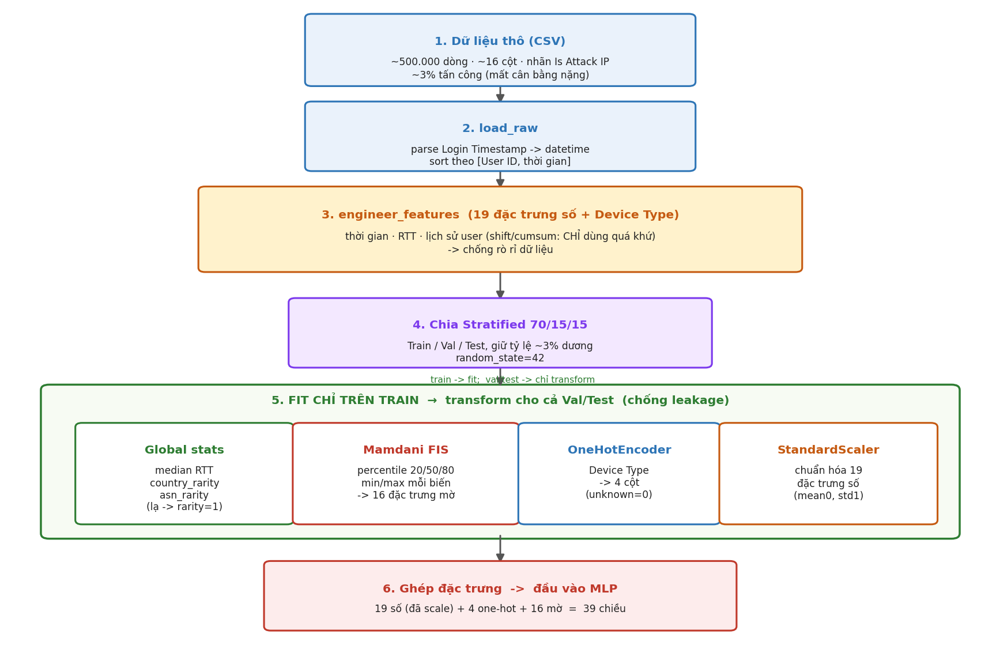

# Dữ liệu & Tiền xử lý — Giải thích cặn kẽ (kèm bộ câu hỏi & trả lời)

> **Mục đích file này:** giúp bạn *hiểu thật* phần dữ liệu và tiền xử lý, để tự diễn đạt
> lại bằng lời của mình khi viết báo cáo hoặc trả lời câu hỏi — **không phải để copy**.
>
> Mọi con số trong file đều lấy trực tiếp từ mã nguồn trong `rba_local_project/src/` và từ
> pipeline đã fit thật (`rba_local_project/outputs/preprocessing_pipeline.pkl`), nên bạn có
> thể tin và dùng khi bị hỏi.
>
> **Mỗi khi nhắc tới một hàm, file này luôn ghi rõ hàm đó nằm ở file nào** — để khi cô hỏi
> "chỗ đó code ở đâu?" bạn mở đúng file ngay. Bảng tra nhanh ở mục 0.2.
>
> Bộ Q&A ngắn gọn hơn (dạng gạch đầu dòng, để viết tay) nằm ở `QA_Data_TienXuLy.md`.

---

# PHẦN A — GIẢI THÍCH

## 0.1. Bức tranh tổng thể trước khi đi vào chi tiết



Toàn bộ quá trình có thể kể thành **một câu**:

> Từ file log đăng nhập thô, ta *sinh ra các đặc trưng mô tả ngữ cảnh và hành vi*,
> *chia dữ liệu* thành 3 phần, *học các tham số tiền xử lý chỉ trên phần train*, rồi
> *ghép mọi thứ thành một vector 39 chiều* để đưa vào mạng MLP.

Năm bước, mỗi bước một nhiệm vụ rõ ràng — kèm **file** và **hàm** phụ trách:

| Bước | Làm gì | Hàm phụ trách | Nằm ở file |
|---|---|---|---|
| 1 | Đọc CSV, sắp xếp theo user + thời gian | `load_raw()` | `features.py` |
| 2 | Sinh 19 đặc trưng số + 1 cột phân loại | `engineer_features()` | `features.py` |
| 3 | Chia Train/Val/Test = 70/15/15 | `prepare_splits()` | `dataset_prep.py` |
| 4 | Fit các bộ tiền xử lý **chỉ trên train** | `fit_global_stats()`, `apply_global_stats()` | `features.py` |
| 4 | (cùng bước 4) Fit hệ mờ Mamdani | `MamdaniFuzzyRiskSystem.fit()` | `fuzzy_mamdani.py` |
| 5 | Ghép thành vector 39 chiều | `prepare_splits()` (phần cuối) | `dataset_prep.py` |

Hàm điều phối toàn bộ 5 bước trên là `main()` trong **`train.py`** — muốn xem luồng chạy
từ đầu đến cuối thì mở file đó trước.

## 0.2. Bản đồ mã nguồn — hàm nào nằm ở file nào

Toàn bộ mã nguồn ở thư mục `rba_local_project/src/`. Bảng tra nhanh:

| File | Chứa gì | Vai trò |
|---|---|---|
| `config.py` | Hằng số: `TARGET_COLUMN`, `RANDOM_STATE`, `TEST_SIZE`, `VAL_TEST_SPLIT`, `EPOCHS`, `BATCH_SIZE`, `LEARNING_RATE`, `HIDDEN_DIMS`, `DROPOUT`, `EARLY_STOPPING_PATIENCE`, `FUZZY_OUTPUT_GRID_POINTS`, các đường dẫn | Cấu hình chung, **không có hàm** |
| `features.py` | `load_raw()`, `engineer_features()`, `fit_global_stats()`, `apply_global_stats()`; hằng số `FEATURE_COLUMNS_NUMERIC` (19 đặc trưng), `FEATURE_COLUMNS_CATEGORICAL` | **Sinh đặc trưng** |
| `fuzzy_mamdani.py` | `triangular()`, `low_med_high()`, lớp `MamdaniFuzzyRiskSystem` (các phương thức `fit()`, `_fuzzify()`, `_rule_base()`, `transform()`); hằng số `FUZZY_FEATURE_COLUMNS` | **Hệ suy diễn mờ** |
| `dataset_prep.py` | `prepare_splits()` (bên trong có hàm phụ `make_cat()`) | **Chia tập + fit tiền xử lý** |
| `model.py` | Lớp `MLPClassifier` (`__init__()`, `forward()`), `to_tensor()`, `train_mlp()`, `evaluate()` | **Mạng MLP + huấn luyện/đánh giá** |
| `train.py` | `main()` | **Script chính**, gọi tất cả các bước |
| `inference.py` | `load_pipeline_and_model()`, `predict_risk()`, `_demo()` | **Suy luận** trên dữ liệu mới |
| `visualize.py` | `plot_training_curves()`, `plot_metrics_bar()`, `plot_confusion_matrix()`, `plot_roc_pr_curves()`, `plot_threshold_curve()`, `plot_all()` | **Vẽ biểu đồ** |

> **Lưu ý phân biệt:** ngoài các hàm *của nhóm* ở trên, code còn dùng nhiều hàm **của thư
> viện**: `sort_values()`, `groupby()`, `shift()`, `cumsum()`, `cumcount()`, `fillna()`,
> `value_counts()` là của **pandas**; `train_test_split()`, `StandardScaler`,
> `OneHotEncoder` là của **scikit-learn**. Khi cô hỏi "hàm này em tự viết hay dùng sẵn?"
> thì cần trả lời đúng chỗ này.

---

## 1. Bộ dữ liệu — có gì trong đó?

> 📁 **Code liên quan:** khai báo nhãn `TARGET_COLUMN = "Is Attack IP"` và đường dẫn dữ
> liệu `DATA_PATH` đều nằm ở **`config.py`**.

### 1.1. Nguồn và quy mô

- **Tên:** *Login Data Set for Risk-Based Authentication* — Wiefling, Lo Iacono, Dürmuth.
- **Bản chất:** log đăng nhập **thật** của một dịch vụ trực tuyến, đã được **ẩn danh hóa**
  (không còn thông tin nhận dạng cá nhân). Đây không phải dữ liệu giả lập — điểm này đáng
  nhấn khi báo cáo, vì nó làm kết quả có giá trị thực tiễn hơn.
- **Quy mô dùng trong đồ án:** ~**500.000 dòng**, mỗi dòng = **một lượt đăng nhập**.
- **Nhãn cần dự đoán:** `Is Attack IP` — lượt đăng nhập này có đến từ IP tấn công không?
  → Bài toán **phân loại nhị phân** (0/1).

### 1.2. Các cột thô được dùng

| Cột thô | Nội dung | Dùng để làm gì |
|---|---|---|
| `Login Timestamp` | Thời điểm đăng nhập | Sinh đặc trưng thời gian + tính khoảng cách giữa 2 lần đăng nhập |
| `User ID` | Mã người dùng | Nhóm dữ liệu theo từng người để tính lịch sử hành vi |
| `Round-Trip Time [ms]` | Độ trễ mạng (có thể **thiếu**) | Gợi ý về chất lượng/loại kết nối |
| `Country`, `City`, `ASN` | Quốc gia, thành phố, nhà mạng | Vị trí & nhà cung cấp mạng → tín hiệu rất mạnh cho rủi ro |
| `Device Type` | Loại thiết bị | Thiết bị lạ = đáng ngờ |
| `Browser Name and Version` | Trình duyệt | Đổi trình duyệt đột ngột = đáng ngờ |
| `OS Name and Version` | Hệ điều hành | Tương tự trên |
| `Login Successful` | Đăng nhập thành công? | Tính tỉ lệ thành công trong quá khứ của user |
| **`Is Attack IP`** | **NHÃN** | Cái ta cần dự đoán |

> **ASN là gì?** Autonomous System Number — mã định danh của một nhà mạng / nhà cung cấp
> hạ tầng Internet (ví dụ VNPT, Viettel, hoặc một nhà cung cấp VPS nào đó). Tấn công
> thường đến từ ASN của các nhà cung cấp máy chủ ảo / VPN, khác hẳn ASN của nhà mạng dân
> dụng mà người dùng thật hay dùng. Vì vậy ASN là một tín hiệu rất giá trị.

### 1.3. Hai đặc điểm quan trọng nhất của bộ dữ liệu

**(a) Mất cân bằng lớp rất nặng — chỉ ~3% là tấn công.**

Hệ quả kéo theo toàn bộ đồ án:

- **Không thể dùng Accuracy** làm chỉ số chính. Một mô hình "ngu" đoán *"mọi lượt đều
  bình thường"* sẽ đạt Accuracy ≈ 97% mà **không bắt được một tấn công nào**. Con số 97%
  nghe rất đẹp nhưng vô dụng.
- → Phải dùng **AUPRC, Recall, Precision** (các chỉ số nhạy với lớp thiểu số). Các chỉ số
  này được tính trong hàm `evaluate()` ở **`model.py`**.
- → Lúc huấn luyện phải **bù lệch lớp** bằng `pos_weight` — đặt trong hàm `train_mlp()` ở
  **`model.py`**.

**(b) Dữ liệu tập trung mạnh về mặt địa lý.**

Thống kê thật từ tập train: **Na Uy (NO) chiếm 82,1%** số lượt đăng nhập, US 3,7%,
PL 3,6%; tổng cộng 92 quốc gia và 1.200 ASN khác nhau.

Điều này có ý nghĩa: "quốc gia lạ" trong bộ dữ liệu này là một tín hiệu **rất mạnh**, vì
đại đa số lưu lượng bình thường đến từ đúng một quốc gia. (Xem thêm mục 9 — điểm này gây
ra một hệ quả thú vị cho hệ mờ.)

---

## 2. Bước 1 — Đọc dữ liệu & sắp xếp (nhỏ nhưng cực kỳ quan trọng)

> 📁 **Hàm `load_raw()` — nằm ở `features.py`.** Được gọi từ `main()` trong `train.py`.

```python
def load_raw(path: str) -> pd.DataFrame:        # features.py
    df = pd.read_csv(path)
    df["Login Timestamp"] = pd.to_datetime(df["Login Timestamp"])
    df = df.sort_values(["User ID", "Login Timestamp"]).reset_index(drop=True)
    return df
```

Ba việc:
1. Đọc file CSV (`read_csv` — của **pandas**).
2. Đổi cột thời gian từ *chuỗi văn bản* sang *kiểu ngày–giờ* (`to_datetime` — của
   **pandas**), để có thể **trừ hai thời điểm cho nhau**.
3. **Sắp xếp theo `User ID`, rồi theo thời gian** (`sort_values` — của **pandas**).

### Vì sao bước sắp xếp lại quan trọng đến vậy?

Vì ở `engineer_features()` (cũng trong `features.py`), ta sẽ dùng `shift(1)` — nghĩa là
"lấy giá trị của **dòng ngay phía trên**" — để biết lần đăng nhập trước của user. Nếu dữ
liệu không được sắp đúng thứ tự, "dòng phía trên" sẽ **không phải** là lần đăng nhập trước
đó, và **toàn bộ** đặc trưng lịch sử sai.

Minh họa cho dễ thấy:

| Chưa sắp xếp | | Đã sắp xếp đúng | |
|---|---|---|---|
| User A — 10/02 | ← dòng 1 | User A — 05/02 | ← dòng 1 |
| User B — 03/02 | ← dòng 2 | User A — 10/02 | ← dòng 2 |
| User A — 05/02 | ← dòng 3 | User B — 03/02 | ← dòng 3 |

Ở bảng trái, khi xử lý dòng 3 (User A, 05/02), `shift(1)` sẽ lấy dòng 2 là **User B** —
sai người. Và ngay cả khi cùng user, thứ tự thời gian bị đảo thì "lần trước" thành "lần
sau" — tức là ta đang lấy **thông tin tương lai**, một dạng rò rỉ dữ liệu.

---

## 3. Bước 2 — Sinh 19 đặc trưng số (+ 1 cột phân loại)

> 📁 **Hàm `engineer_features()` — nằm ở `features.py`.** Danh sách 19 đặc trưng được khai
> báo ở hằng số `FEATURE_COLUMNS_NUMERIC`, cột phân loại ở `FEATURE_COLUMNS_CATEGORICAL`
> — **cả hai cũng trong `features.py`**.

Máy học không hiểu được chuỗi `"2020-02-10 03:15"` hay `"Norway"`. Ta phải biến chúng thành
**số**, đồng thời tạo ra những con số *nói lên điều gì đó về mức rủi ro*.

### 3.1. Nhóm thời gian — 4 đặc trưng (tính trực tiếp, luôn an toàn)

| Đặc trưng | Cách tính | Vì sao liên quan tới rủi ro |
|---|---|---|
| `hour_of_day` | Giờ trong ngày (0–23) | Người thật có giờ sinh hoạt; bot/tấn công thường hoạt động bất kể giờ |
| `day_of_week` | Thứ trong tuần (0=T2 … 6=CN) | Mẫu hành vi khác nhau giữa ngày làm việc và cuối tuần |
| `is_weekend` | 1 nếu `day_of_week ≥ 5` | Gộp gọn tín hiệu cuối tuần |
| `is_odd_hour` | 1 nếu giờ `< 6` **hoặc** `> 22` | Đăng nhập lúc 2–3h sáng đáng ngờ hơn 2h chiều |

Bốn đặc trưng này chỉ phụ thuộc **chính dòng đang xét** (thuật ngữ: *row-local*), nên
không có nguy cơ rò rỉ gì.

### 3.2. Nhóm mạng (RTT) — 2 đặc trưng

| Đặc trưng | Cách tính | Tính ở hàm nào |
|---|---|---|
| `rtt_missing` | 1 nếu cột RTT bị thiếu (NaN) | `engineer_features()` — `features.py` |
| `rtt_filled` | Giá trị RTT, chỗ thiếu điền bằng **trung vị của tập train** | `apply_global_stats()` — `features.py` |

**Vì sao không xóa dòng thiếu RTT?** Hai lý do:
1. Sẽ mất rất nhiều dữ liệu.
2. Quan trọng hơn: **bản thân việc "thiếu RTT" có thể là một tín hiệu**. Nó có thể liên
   quan đến loại kết nối hoặc cách client gửi request. Nên ta *giữ thông tin đó lại* dưới
   dạng cờ `rtt_missing` thay vì bỏ đi.

**Vì sao điền bằng trung vị (median) mà không phải trung bình (mean)?** Vì RTT có phân
phối lệch với nhiều giá trị ngoại lai rất lớn (mạng chậm bất thường); trung bình sẽ bị
các giá trị đó kéo lệch, còn trung vị bền vững hơn.

> **Chú ý về sự phân công giữa 2 hàm:** `rtt_missing` tính ngay trong
> `engineer_features()` vì nó *row-local* (an toàn). Còn `rtt_filled` **không** tính ở đó,
> mà để sang `apply_global_stats()` — vì nó cần "trung vị của tập train", tức một con số
> **học từ dữ liệu**. Trung vị thật đã fit được: **535,0 ms**.

### 3.3. Nhóm độ hiếm (rarity) — 2 đặc trưng

> 📁 Cả hai được tạo ở hàm `apply_global_stats()` trong **`features.py`** (không phải ở
> `engineer_features()`), vì cần bảng tần suất học từ tập train.

| Đặc trưng | Công thức | Ý nghĩa |
|---|---|---|
| `country_rarity` | `1 − tần_suất(quốc gia)` | Càng gần 1 = quốc gia càng ít gặp |
| `asn_rarity` | `1 − tần_suất(ASN)` | Càng gần 1 = nhà mạng càng ít gặp |

Ví dụ với số thật: Na Uy chiếm 82,1% → `country_rarity = 1 − 0,821 = 0,179` (rất phổ biến).
Một quốc gia chưa từng xuất hiện trong train → tần suất 0 → `rarity = 1` (cực hiếm).

### 3.4. Nhóm lịch sử hành vi người dùng — 11 đặc trưng (phần tinh vi nhất)

> 📁 Toàn bộ nhóm này tính trong `engineer_features()` — **`features.py`**.

Ý tưởng cốt lõi: **so sánh lượt đăng nhập hiện tại với những gì user đó đã làm trước đây.**
Một lượt đăng nhập "bình thường" với người A có thể rất bất thường với người B.

```python
# trong engineer_features() — features.py
g = df.groupby("User ID", sort=False)
df["prev_timestamp"] = g["Login Timestamp"].shift(1)   # thời điểm lần TRƯỚC
```

| Đặc trưng | Cách tính | Trường hợp đăng nhập đầu tiên |
|---|---|---|
| `time_since_last_login_h` | (giờ hiện tại − giờ lần trước), đơn vị giờ | Không có lần trước → điền `24×365 = 8760` giờ |
| `is_first_login` | 1 nếu không có lần trước | = 1 |
| `is_new_country` | 1 nếu quốc gia ≠ quốc gia lần trước | = 1 |
| `is_new_city` | tương tự với thành phố | = 1 |
| `is_new_asn` | tương tự với ASN | = 1 |
| `is_new_device` | tương tự với loại thiết bị | = 1 |
| `is_new_browser` | tương tự với trình duyệt | = 1 |
| `is_new_os` | tương tự với hệ điều hành | = 1 |
| `user_success_rate_so_far` | tỉ lệ đăng nhập thành công **trước** lượt này | Không có lịch sử → điền `1.0` |
| `user_login_count_so_far` | số lần đã đăng nhập **trước** lượt này | = 0 |
| `num_changes` | tổng của 6 cờ `is_new_*` (giá trị 0–6) | = 6 (mọi thứ đều mới) |

**`num_changes` là đặc trưng rất "thông minh":** đổi *một* thứ (ví dụ chỉ đổi trình duyệt)
là bình thường. Nhưng đổi **cùng lúc 6 thứ** — quốc gia, thành phố, nhà mạng, thiết bị,
trình duyệt, hệ điều hành — thì gần như chắc chắn không còn là người dùng đó nữa. Một con
số duy nhất gói được mức độ "mọi thứ đều lạ".

**Vì sao lần đăng nhập đầu điền `time_since = 8760` giờ (1 năm)?** Vì thực tế không có
"lần trước" nào. Điền một số rất lớn để hệ thống hiểu là "đã rất lâu / không có lịch sử",
thay vì để trống (máy không xử lý được giá trị trống) hoặc điền 0 (sẽ bị hiểu sai thành
"vừa mới đăng nhập xong").

**Vì sao `user_success_rate_so_far` lần đầu điền `1.0`?** Đây là lựa chọn "cho hưởng lợi
của sự nghi ngờ" (benefit of the doubt) — coi user mới là bình thường thay vì mặc định
nghi ngờ họ. Nếu điền 0, mọi user mới đều bị đánh dấu như người có lịch sử đăng nhập thất
bại toàn bộ, làm tăng báo động giả.

---

## 4. Bước quan trọng nhất về phương pháp: **chống rò rỉ dữ liệu**

### 4.1. Rò rỉ dữ liệu (data leakage) là gì?

**Định nghĩa dễ hiểu:** rò rỉ dữ liệu là khi mô hình được "nhìn thấy" thông tin mà **lúc
dự đoán thật nó không thể có**.

**So sánh cho dễ nhớ:** giống như một học sinh **được xem đáp án trước khi thi**. Điểm thi
sẽ rất cao, nhưng con điểm đó **không phản ánh** năng lực thật. Khi ra đề mới (dữ liệu
thật, môi trường thật), học sinh đó làm tệ hơn hẳn.

Hậu quả cụ thể trong đồ án này: nếu để rò rỉ, các chỉ số AUROC/AUPRC lúc test sẽ **cao
giả tạo**, và khi triển khai thật mô hình sẽ hoạt động kém hơn nhiều so với con số đã báo cáo.

### 4.2. Có **hai loại** rò rỉ trong bài toán này

Đây là chỗ nên hiểu rõ, vì hai loại này chống bằng hai cách khác nhau, **ở hai file khác nhau**.

**Loại 1 — Rò rỉ theo thời gian ("nhìn vào tương lai").**
📁 Chống ở `engineer_features()` — **`features.py`**.

Xảy ra khi tính đặc trưng cho lượt đăng nhập tại thời điểm *t* nhưng lại dùng thông tin
xảy ra **sau** *t*.

*Ví dụ SAI:* tính `user_success_rate` = tỉ lệ thành công trên **toàn bộ** lịch sử của user
(cả quá khứ lẫn tương lai). Lúc dự đoán thật ta chưa biết tương lai → không thể có con số này.

*Cách chống trong code:*
- `shift(1)` → chỉ lấy **đúng lần liền trước**.
- `cumsum() − giá_trị_hiện_tại` → cộng dồn quá khứ nhưng **loại trừ chính dòng đang xét**.

Xem ví dụ số cụ thể ngay dưới đây:

| Lượt | Thành công? | `cumsum` (gồm cả hiện tại) | `cumsum − hiện tại` = **quá khứ** | Số lượt trước | `success_rate_so_far` |
|---|---|---|---|---|---|
| 1 | 1 | 1 | 0 | 0 | → điền 1.0 (không có lịch sử) |
| 2 | 1 | 2 | 1 | 1 | 1/1 = 1.00 |
| 3 | 0 | 2 | 2 | 2 | 2/2 = 1.00 |
| 4 | 1 | 3 | 2 | 3 | 2/3 = 0.67 |

Chú ý dòng 3: user **thất bại** ở lượt này, nhưng `success_rate_so_far` vẫn = 1.00 — đúng,
vì tại *thời điểm trước khi* lượt 3 xảy ra, mọi lần đăng nhập trước đó đều thành công. Con
số này chỉ phản ánh **những gì đã biết**, không hề chứa kết quả của lượt đang xét. Nếu
không trừ đi giá trị hiện tại, dòng 3 sẽ thành 2/3 = 0,67 — tức là ta đã dùng kết quả của
chính lượt đang cần dự đoán để mô tả nó. Đó chính là rò rỉ.

**Loại 2 — Rò rỉ giữa các tập (train "biết" về val/test).**
📁 Chống ở `prepare_splits()` — **`dataset_prep.py`**, bằng cách gọi `fit_global_stats()`
chỉ với `df_train`.

Xảy ra khi một tham số được **học từ dữ liệu** lại được tính trên cả val/test.

*Ví dụ SAI:* tính trung vị RTT trên **toàn bộ** 500.000 dòng, rồi dùng nó để điền giá trị
thiếu cho cả 3 tập. Vấn đề: con số trung vị đó đã "hấp thụ" thông tin từ tập test — mô
hình gián tiếp biết một chút về phân bố của tập dùng để đánh giá nó.

*Cách chống:* mọi thứ học từ dữ liệu đều fit **chỉ trên train** (mục 6).

### 4.3. Hai lỗi rò rỉ nhóm đã tự phát hiện & sửa

> Đây là điểm **rất nên chủ động nhắc** khi báo cáo — nó cho thấy nhóm hiểu bản chất và
> tự kiểm tra lại công việc của mình, chứ không chỉ chạy cho ra kết quả.

**Lỗi 1 — Thống kê toàn cục tính trên cả bộ dữ liệu.**
📁 *Sửa ở:* `features.py` (tách hàm) + `dataset_prep.py` (gọi đúng cách) + `inference.py`
(áp lại lúc suy luận).

Ban đầu, trung vị RTT và tần suất Country/ASN được tính trên **toàn bộ** `df` (gồm cả
val/test) → rò rỉ loại 2.
*Đã sửa:* tách thành hai hàm rõ ràng trong `features.py` —
`fit_global_stats(df_train)` chỉ **nhận tập train**, và `apply_global_stats(df, stats)` để
**áp** thống kê đó cho bất kỳ tập nào. `prepare_splits()` trong `dataset_prep.py` gọi
`fit_global_stats()` **chỉ với `df_train`**, rồi `apply_global_stats()` cho cả 3 tập.
Thống kê này được lưu vào pipeline dưới khóa `global_stats` và được `predict_risk()`
trong `inference.py` áp lại y hệt khi suy luận.

**Lỗi 2 — Ngưỡng min/max của hệ mờ tính lại theo từng lô dữ liệu.**
📁 *Sửa ở:* `fuzzy_mamdani.py` — trong phương thức `fit()` của lớp `MamdaniFuzzyRiskSystem`
và hàm `low_med_high()`.

Hàm mờ hóa cần biết min/max của mỗi biến. Ban đầu nó tính min/max **ngay trên lô dữ liệu
được truyền vào**. Khi chạy trên 500.000 dòng thì không thấy vấn đề, nhưng lúc **suy luận
cho 1 dòng đơn lẻ** thì min = max = chính giá trị của dòng đó → hàm thuộc bị méo hoàn
toàn, kết quả vô nghĩa.
*Đã sửa:* lưu min/max **cố định** từ lúc `fit()` trên train (thuộc tính `self.minmax_`),
và truyền lại y hệt cho `low_med_high()` ở mọi lần suy luận sau. Trong `fuzzy_mamdani.py`
còn có ghi chú cảnh báo ngay trên hàm `low_med_high()` để không ai lặp lại lỗi này.

Lỗi 2 đặc biệt đáng nói vì nó là loại lỗi **không hề làm sai kết quả lúc đánh giá theo lô**,
chỉ bộc lộ khi đưa mô hình vào dùng thật — rất dễ bị bỏ sót.

---

## 5. Bước 3 — Chia Train / Val / Test = 70/15/15

> 📁 **Hàm `prepare_splits()` — nằm ở `dataset_prep.py`.** Dùng `train_test_split()` của
> **scikit-learn**. Các tỉ lệ `TEST_SIZE = 0.30`, `VAL_TEST_SPLIT = 0.50` và
> `RANDOM_STATE = 42` khai báo ở **`config.py`**.

```python
# trong prepare_splits() — dataset_prep.py
# tách 30% ra làm (val + test), giữ đúng tỉ lệ nhãn
idx_train, idx_temp = train_test_split(idx, test_size=TEST_SIZE, stratify=y,
                                       random_state=RANDOM_STATE)
# 30% đó chia đôi → 15% val, 15% test
idx_val, idx_test   = train_test_split(idx_temp, test_size=VAL_TEST_SPLIT,
                                       stratify=y_temp, random_state=RANDOM_STATE)
```

Kết quả thật khi chạy:

| Tập | Số dòng | Tỉ lệ dương (tấn công) |
|---|---|---|
| Train | 350.000 | 3,0611% |
| Validation | 75.000 | 3,0613% |
| Test | 75.000 | 3,0613% |

### Ba điều cần giải thích được

**(a) Vì sao cần tới 3 tập, không phải 2?**
- **Train** — để mô hình *học* trọng số (trong `train_mlp()` — `model.py`).
- **Validation** — để *chọn* mô hình tốt nhất và quyết định *khi nào dừng* (early stopping,
  cũng trong `train_mlp()` — `model.py`, theo `EARLY_STOPPING_PATIENCE` ở `config.py`).
  Nếu dùng test cho việc này, ta đã "chạm" vào test nhiều lần → test không còn khách quan.
- **Test** — dùng **đúng một lần** ở cuối để báo cáo con số trung thực (qua `evaluate()`
  — `model.py`).

**(b) `stratify` (phân tầng) là gì và vì sao cần?**
`stratify=y` buộc tỉ lệ ~3% dương phải **giữ nguyên ở cả 3 tập** — nhìn bảng trên thấy rõ:
3,0611% / 3,0613% / 3,0613%, gần như y hệt nhau.

Nếu chia ngẫu nhiên thường, tập test có thể "hên xui" chỉ còn 2% hoặc lên 4% dương. Với
AUPRC — chỉ số **rất nhạy với tỉ lệ lớp dương** — con số đo được sẽ nhảy loạn giữa các lần
chia khác nhau, không thể so sánh công bằng và khó tái lập.

**(c) `random_state=42` để làm gì?**
Cố định bộ sinh số ngẫu nhiên → chạy lại 10 lần vẫn ra **đúng cùng một cách chia**. Đây là
yêu cầu cơ bản về **khả năng tái lập (reproducibility)**: người khác chạy lại code phải ra
được kết quả giống bạn. Hằng số này khai báo ở `config.py` để dùng thống nhất cả dự án.

---

## 6. Bước 4 — Fit các bộ tiền xử lý **CHỈ trên train**

> 📁 **Tất cả diễn ra trong `prepare_splits()` — `dataset_prep.py`.** Hàm này gọi sang
> `features.py` (thống kê toàn cục) và `fuzzy_mamdani.py` (hệ mờ), cộng thêm 2 bộ của
> scikit-learn.

Quy tắc vàng, chỉ cần nhớ đúng một dòng:

> **Train → `fit` (học tham số) rồi `transform`. Val/Test → CHỈ `transform`.**

Có **4 bộ** cần fit. Dưới đây là tham số thật đã học được (lấy từ pipeline đã lưu):

### 6.1. Thống kê toàn cục

📁 Hàm `fit_global_stats()` và `apply_global_stats()` — **`features.py`**.

| Tham số học được | Giá trị thật |
|---|---|
| `rtt_median` | **535,0 ms** |
| `country_freq` | 92 quốc gia (NO 82,1% · US 3,7% · PL 3,6% …) |
| `asn_freq` | 1.200 ASN |

Rồi áp cho mọi tập: `rtt_filled`, `country_rarity = 1 − freq`, `asn_rarity = 1 − freq`.

**Xử lý giá trị lạ (chưa từng thấy trong train):** tra bảng tần suất không thấy → `fillna(0)`
→ `rarity = 1 − 0 = 1` = **cực hiếm**. Đây là hành vi *rất hợp lý về mặt bảo mật*: một quốc
gia/nhà mạng hoàn toàn lạ thì đúng là đáng ngờ nhất.

### 6.2. Hệ mờ Mamdani

📁 Lớp `MamdaniFuzzyRiskSystem` — **`fuzzy_mamdani.py`**. Phương thức `fit()` học ngưỡng;
`transform()` sinh đặc trưng; hai hàm hỗ trợ là `triangular()` (hàm thuộc tam giác) và
`low_med_high()` (dựng 3 mức Low/Med/High) — **cùng file**.

`fit()` học **ngưỡng phân vị 20/50/80** và **min/max** cho 5 biến liên tục. Giá trị thật:

| Biến | p20 | p50 | p80 | min | max |
|---|---|---|---|---|---|
| `time_since_last_login_h` | 0,198 (≈12 phút) | 44,62 (≈1,9 ngày) | 360,0 (15 ngày) | 0 | 8760 |
| `country_rarity` | 0,1786 | 0,1786 | 0,1786 | 0,1786 | 1,0 |
| `asn_rarity` | 0,4766 | 0,4766 | 0,9945 | 0,4766 | 1,0 |
| `user_success_rate_so_far` | 0,75 | 0,9444 | 1,0 | 0 | 1,0 |
| `num_changes` | 0 | 1 | 3 | 0 | 6 |

Đầu ra của `transform()`: **15 mức độ thuộc** (5 biến × 3 mức Low/Med/High) + **1 điểm rủi
ro centroid** = **16 đặc trưng mờ** (tên cột liệt kê ở hằng số `FUZZY_FEATURE_COLUMNS`,
cũng trong `fuzzy_mamdani.py`). Số điểm lưới để giải mờ là `FUZZY_OUTPUT_GRID_POINTS = 51`
— khai báo ở **`config.py`**.

> Chi tiết 8 luật IF–THEN (trong phương thức `_rule_base()`) và cách ra điểm centroid: xem
> `GiaiThich_ThuatToan_ViDu.md`.

Ví dụ đọc bảng cho dễ hình dung — với `num_changes` (p20=0, p50=1, p80=3, max=6):

| `num_changes` | Low | Med | High | Nghĩa |
|---|---|---|---|---|
| 0 | 1,00 | 0,00 | 0,00 | Không đổi gì → chắc chắn "thấp" |
| 1 | 0,00 | 1,00 | 0,00 | Đổi 1 thứ → "trung bình" |
| 3 | 0,00 | 0,00 | 0,40 | Đổi 3 thứ → bắt đầu "cao" |
| 6 | 0,00 | 0,00 | 1,00 | Đổi cả 6 thứ → chắc chắn "cao" |

### 6.3. One-Hot Encoding cho `Device Type`

📁 Dùng `OneHotEncoder` của **scikit-learn**, gọi trong `prepare_splits()` —
**`dataset_prep.py`** (có hàm phụ `make_cat()` để áp cho từng tập).

Máy không hiểu chữ `"mobile"`, nên đổi thành các cột 0/1. Kết quả thật: **4 cột** —
`Device Type_desktop`, `Device Type_mobile`, `Device Type_tablet`, `Device Type_unknown`.

| Thiết bị | desktop | mobile | tablet | unknown |
|---|---|---|---|---|
| `desktop` | 1 | 0 | 0 | 0 |
| `mobile` | 0 | 1 | 0 | 0 |
| loại **lạ** | 0 | 0 | 0 | 0 |

**Vì sao dùng One-Hot mà không gán số 1, 2, 3, 4?** Vì gán số sẽ tạo ra **thứ tự giả**:
máy sẽ hiểu `tablet(3) > mobile(2) > desktop(1)`, và còn suy ra vô nghĩa rằng
"mobile nằm giữa desktop và tablet". Thực tế các loại thiết bị **không có thứ tự** nào cả.
One-Hot loại bỏ hoàn toàn ngộ nhận đó.

**`handle_unknown="ignore"`** nghĩa là: gặp loại thiết bị chưa từng thấy → đặt tất cả cột
= 0, **không báo lỗi**. Rất cần thiết cho hệ thống chạy thật, vì thiết bị/trình duyệt mới
liên tục xuất hiện.

### 6.4. Chuẩn hóa số (StandardScaler)

📁 Dùng `StandardScaler` của **scikit-learn**, gọi trong `prepare_splits()` —
**`dataset_prep.py`**.

Công thức: `z = (x − μ_train) / σ_train` → mỗi đặc trưng về trung bình 0, độ lệch chuẩn 1.

**Vì sao cần?** Nhìn thang đo thực tế của các đặc trưng:
- `time_since_last_login_h`: từ 0 đến **8.760**
- `is_new_country`: chỉ 0 hoặc **1**

Nếu không chuẩn hóa, đặc trưng có thang đo lớn sẽ **lấn át** hoàn toàn các đặc trưng nhỏ
trong phép tính tổng có trọng số của mạng nơ-ron, khiến mạng gần như bỏ qua các cờ 0/1 —
mà đó lại là những tín hiệu rất giá trị. Ngoài ra chuẩn hóa giúp gradient ổn định → mạng
**hội tụ nhanh hơn**.

---

## 7. Bước 5 — Ghép thành đầu vào 39 chiều

> 📁 Phần cuối của `prepare_splits()` — **`dataset_prep.py`**.

```
X = [19 đặc trưng số đã chuẩn hóa] + [4 cột one-hot Device Type] + [16 đặc trưng mờ Mamdani]
  =  19 + 4 + 16  =  39 chiều
```

Con số **39** này chính là `input_dim` của tầng đầu tiên trong MLP (lớp `MLPClassifier` ở
**`model.py`**) — khớp đúng với output `Input dimension: 39` khi chạy notebook.

Toàn bộ bộ tiền xử lý được **lưu lại thành một file pipeline**
(`outputs/preprocessing_pipeline.pkl`) — việc lưu do `main()` trong **`train.py`** thực
hiện. Pipeline gồm các khóa: `scaler`, `ohe`, `global_stats`, `fis_thresholds`,
`fis_minmax`, `cat_cols`, `input_columns`, `input_dim`.

Lúc suy luận, `load_pipeline_and_model()` trong **`inference.py`** nạp lại đúng file này,
rồi `predict_risk()` (**cùng file**) biến đổi dữ liệu mới **y hệt** như lúc huấn luyện —
nếu không, mô hình sẽ nhận đầu vào có ý nghĩa khác hẳn và dự đoán sai.

---

## 8. Ví dụ xuyên suốt — một user với 3 lượt đăng nhập

Giả sử user **U** có 3 lượt (đã sắp xếp theo thời gian bởi `load_raw()` — `features.py`):

| # | Thời gian | Country | ASN | Device | RTT | Thành công? |
|---|---|---|---|---|---|---|
| L1 | T7 01/02, 09:00 | NO | AS1 | desktop | 100 | Có |
| L2 | T7 01/02, 23:30 | NO | AS1 | desktop | *(thiếu)* | Có |
| L3 | T4 05/02, 03:00 | US | AS9 | mobile | 500 | Không |

**Sau nhóm thời gian & RTT** (`engineer_features()` — `features.py`):

| | hour | day_of_week | is_weekend | is_odd_hour | rtt_missing |
|---|---|---|---|---|---|
| L1 | 9 | 5 (T7) | 1 | 0 | 0 |
| L2 | 23 | 5 (T7) | 1 | **1** (giờ > 22) | **1** (thiếu RTT) |
| L3 | 3 | 2 (T4) | 0 | **1** (giờ < 6) | 0 |

**Sau nhóm lịch sử** (cũng `engineer_features()` — chỉ dùng quá khứ của U):

| | time_since (giờ) | is_first | new_country | new_asn | new_device | num_changes | success_rate_so_far | login_count |
|---|---|---|---|---|---|---|---|---|
| L1 | 8760 *(điền)* | 1 | 1 | 1 | 1 | **6** | 1.0 *(điền)* | 0 |
| L2 | 14,5 | 0 | 0 | 0 | 0 | **0** | 1.0 | 1 |
| L3 | 75,5 | 0 | **1** | **1** | **1** | **6** | 1.0 | 2 |

> Lưu ý L3: `success_rate_so_far` = 1.0 dù **chính lượt L3 thất bại** — đúng như thiết kế,
> vì con số này chỉ tính trên L1 và L2 (đều thành công). Đây là cơ chế chống rò rỉ đang
> hoạt động.

**Sau khi áp thống kê toàn cục** (`apply_global_stats()` — `features.py`; train có
`freq(NO)=0,821`, `freq(US)=0,037`, `rtt_median=535`):

| | rtt_filled | country_rarity | asn_rarity |
|---|---|---|---|
| L1 | 100 | 1 − 0,821 = **0,179** | thấp |
| L2 | **535** *(điền median)* | 0,179 | thấp |
| L3 | 500 | 1 − 0,037 = **0,963** | cao |

**Đưa 5 biến liên tục của L3 qua hệ mờ Mamdani** (`MamdaniFuzzyRiskSystem.transform()` —
`fuzzy_mamdani.py`) → 15 mức độ thuộc + 1 điểm rủi ro. Với `country_rarity = 0,963` (dùng
ngưỡng thật ở mục 6.2) → `high = 0,955` — tức hệ mờ xác nhận "quốc gia này rất hiếm".

**Nhận xét về L3:** cách lần trước 75 giờ, đăng nhập lúc 3h sáng, đổi **cả 6** thuộc tính,
và đến từ quốc gia có điểm độ hiếm **cao gấp ~5,4 lần** so với quốc gia thường dùng
(0,963 so với 0,179). Đây đúng là kiểu lượt đăng nhập mà hệ thống RBA cần chấm điểm rủi ro
cao — và các đặc trưng ta thiết kế đã **nắm bắt được** đầy đủ tín hiệu đó.

**Cuối cùng:** 19 số qua `StandardScaler` + 4 cột one-hot + 16 đặc trưng mờ → vector **39
chiều** (ghép trong `prepare_splits()` — `dataset_prep.py`) → đưa vào `MLPClassifier`
(`model.py`).

---

## 9. Một điểm thú vị (nên biết trước khi bị hỏi)

Nhìn lại bảng ngưỡng ở mục 6.2, `country_rarity` có **p20 = p50 = p80 = 0,1786** — cả ba
phân vị **trùng nhau**. Vì sao? Vì Na Uy chiếm 82,1% dữ liệu, nên khi sắp xếp tất cả giá
trị `country_rarity` lại, phân vị thứ 20, 50 và 80 đều **rơi vào cùng nhóm "Na Uy"** với
cùng một giá trị 0,1786.

Hệ quả cho hàm thuộc của biến này (đã kiểm chứng bằng cách gọi trực tiếp `low_med_high()`
trong `fuzzy_mamdani.py`):

| `country_rarity` | Low | Med | High |
|---|---|---|---|
| 0,1786 (Na Uy) | 1,00 | 1,00 | 0,00 |
| 0,963 (US) | 0,00 | 0,00 | 0,955 |
| 1,000 (quốc gia lạ) | 0,00 | 0,00 | 1,00 |

Nghĩa là với biến `country_rarity`, hai mức Low và Med **không phân biệt được nhau** (cùng
bằng 1 cho lưu lượng Na Uy), chỉ mức **High** là thực sự có phân hóa. Code xử lý trường hợp
suy biến này một cách an toàn — hàm `triangular()` trong **`fuzzy_mamdani.py`** có nhánh
riêng `if a == b == c` — nên không gây lỗi. Nhưng đây là **một hạn chế trung thực** đáng
nêu: mức phân giải của biến này bị giới hạn bởi đặc điểm phân bố quá tập trung của dữ liệu.

Nếu bị hỏi, cách trả lời tốt: thừa nhận đúng hiện tượng, giải thích nguyên nhân (82% Na Uy),
và nêu hướng cải tiến — ví dụ dùng ngưỡng theo phân vị **của riêng các giá trị khác nhau**
thay vì trên toàn bộ dòng, hoặc để **ANFIS tự học** hàm thuộc thay vì đặt cố định (hướng
này đã có trong phần Hướng phát triển của báo cáo).

---

## 10. Tóm tắt 7 điều cần nhớ (kèm file để tra nhanh)

1. **Sắp xếp theo user + thời gian** trước tiên — nếu không, `shift(1)` lấy sai dòng và mọi
   đặc trưng lịch sử đều sai. → `load_raw()` trong `features.py`.
2. **Đặc trưng lịch sử chỉ dùng quá khứ** (`shift`, `cumsum − hiện tại`) → chống rò rỉ
   theo thời gian. → `engineer_features()` trong `features.py`.
3. **Chia stratified 70/15/15** → tỉ lệ 3% dương giữ nguyên ở cả 3 tập
   (3,0611/3,0613/3,0613%). → `prepare_splits()` trong `dataset_prep.py`.
4. **Fit mọi bộ tiền xử lý CHỈ trên train** (trung vị RTT, độ hiếm, ngưỡng Mamdani, scaler,
   one-hot); val/test chỉ được `transform` → chống rò rỉ giữa các tập. → `prepare_splits()`
   trong `dataset_prep.py`.
5. **Giá trị lạ được xử lý an toàn:** Country/ASN lạ → `rarity = 1` (hợp lý về bảo mật);
   thiết bị lạ → one-hot toàn 0, không lỗi. → `apply_global_stats()` trong `features.py`
   và `OneHotEncoder(handle_unknown="ignore")` trong `dataset_prep.py`.
6. **min/max của Mamdani lấy cố định từ train** → suy luận 1 dòng đơn lẻ vẫn cho kết quả
   đúng. → `MamdaniFuzzyRiskSystem.fit()` và `low_med_high()` trong `fuzzy_mamdani.py`.
7. **Đầu vào MLP = 39 chiều** = 19 số + 4 one-hot + 16 mờ. → ghép ở `prepare_splits()`
   (`dataset_prep.py`), nhận bởi `MLPClassifier` (`model.py`).

---

# PHẦN B — BỘ CÂU HỎI & TRẢ LỜI

> Trả lời được viết **ngắn, gạch đầu dòng**, đúng kiểu cần khi viết tay trong 15 phút.
> Đọc để hiểu, đừng học vẹt — cô hỏi xoáy thì phải hiểu mới trả lời được.
> Mỗi câu có ghi **file chứa code** liên quan, để nếu cô hỏi thêm "chỗ đó ở đâu" thì mở đúng file.

## Nhóm 1 — Dữ liệu (câu dễ, chắc chắn cần thuộc)

**Q1. Bộ dữ liệu lấy từ đâu, quy mô thế nào?**
- *Login Data Set for Risk-Based Authentication* — Wiefling, Lo Iacono, Dürmuth.
- Log đăng nhập **thật**, đã ẩn danh hóa (không phải dữ liệu giả lập).
- ~500.000 dòng, mỗi dòng = 1 lượt đăng nhập; 16 cột thô.
- 📁 Đường dẫn dữ liệu khai báo ở `config.py` (`DATA_PATH`, `DATA_FILENAME`).

**Q2. Nhãn cần dự đoán là gì? Vì sao chọn nhãn đó mà không phải nhãn khác?**
- Nhãn: **`Is Attack IP`** (lượt đăng nhập có đến từ IP tấn công không).
- Loại `Is Account Takeover`: chỉ ~4 mẫu dương / 500.000 dòng → quá ít để học.
- Loại `Login Successful`: phản ánh **lỗi kỹ thuật** (sai mật khẩu, lỗi mạng), không phải rủi ro bảo mật.
- Chọn `Is Attack IP`: ~3% dương → đủ dữ liệu, và đúng bản chất bài toán chấm điểm rủi ro.
- 📁 Khai báo ở `config.py`: `TARGET_COLUMN = "Is Attack IP"`.

**Q3. Vì sao không dùng Accuracy để đánh giá?**
- Chỉ cần đoán "không phải tấn công" cho mọi dòng đã đạt Accuracy ~97% mà **không bắt được tấn công nào**.
- → Dùng **AUPRC, Recall, Precision** (nhạy với lớp thiểu số).
- Lúc train cũng bù lệch lớp bằng `pos_weight` trong hàm loss.
- 📁 Các chỉ số tính ở `evaluate()` — `model.py`; `pos_weight` đặt trong `train_mlp()` — cũng `model.py`.

**Q4. Dữ liệu có đặc điểm phân bố nào đáng chú ý?**
- Rất tập trung về địa lý: **Na Uy chiếm 82,1%** lưu lượng train (US 3,7%, PL 3,6%).
- Tổng 92 quốc gia, 1.200 ASN.
- → "Quốc gia lạ" là tín hiệu rất mạnh trong bộ dữ liệu này.
- 📁 Bảng tần suất do `fit_global_stats()` tạo — `features.py`; lưu trong pipeline dưới khóa `global_stats`.

## Nhóm 2 — Feature engineering

**Q5. Sinh ra bao nhiêu đặc trưng, chia nhóm thế nào?**
- **19 đặc trưng số** + 1 cột phân loại (`Device Type`, sau đó one-hot thành 4 cột).
- 4 nhóm: (1) thời gian — 4 đặc trưng; (2) mạng/RTT — 2; (3) độ hiếm Country/ASN — 2; (4) lịch sử hành vi user — 11.
- 📁 Tất cả sinh trong `engineer_features()` — `features.py`; danh sách 19 cột ở hằng số `FEATURE_COLUMNS_NUMERIC` (cùng file). Riêng `rtt_filled`, `country_rarity`, `asn_rarity` tạo ở `apply_global_stats()` (cũng `features.py`).

**Q6. RTT thiếu thì xử lý sao? Vì sao không xóa dòng?**
- Không xóa: mất nhiều dữ liệu, và **bản thân "thiếu RTT" có thể là tín hiệu**.
- Tạo cờ `rtt_missing` (an toàn, chỉ nhìn đúng dòng đó).
- Điền giá trị bằng **trung vị của tập train** = **535,0 ms** (`rtt_filled`).
- Dùng trung vị chứ không dùng trung bình vì RTT lệch, có nhiều ngoại lai lớn.
- 📁 `rtt_missing` ở `engineer_features()`; `rtt_filled` ở `apply_global_stats()` — cả hai trong `features.py`.

**Q7. `is_new_country` (và các `is_new_*`) tính thế nào?**
- So sánh giá trị hiện tại với giá trị của **lần đăng nhập ngay trước đó của cùng user** (`shift(1)` của pandas).
- Khác → 1, giống → 0.
- Lần đăng nhập **đầu tiên** của user → quy ước tất cả = 1 (mọi thứ đều "mới").
- 📁 `engineer_features()` — `features.py`.

**Q8. `num_changes` là gì, vì sao hữu ích?**
- Tổng của 6 cờ `is_new_*` → giá trị 0–6.
- Ý nghĩa: đổi **1** thứ là bình thường; đổi **cả 6** thứ cùng lúc (quốc gia, thành phố, ASN, thiết bị, trình duyệt, OS) thì gần như không còn là người dùng đó.
- Gói toàn bộ mức độ "mọi thứ đều lạ" vào **một con số duy nhất**.
- 📁 `engineer_features()` — `features.py`. Đây cũng là 1 trong 5 biến đầu vào của hệ mờ (`fuzzy_mamdani.py`).

**Q9. Vì sao `country_rarity = 1 − tần_suất` mà không dùng thẳng tần suất?**
- Để hướng của con số **cùng chiều với rủi ro**: giá trị càng lớn = càng hiếm = càng đáng ngờ.
- Dễ đọc và dễ viết luật mờ hơn (ví dụ luật "IF `asn_rarity` High THEN rủi ro High").
- 📁 Công thức ở `apply_global_stats()` — `features.py`; luật mờ ở `_rule_base()` — `fuzzy_mamdani.py`.

**Q10. Vì sao lần đăng nhập đầu điền `time_since = 8760` giờ và `success_rate = 1.0`?**
- `8760` (= 24×365, một năm): thực tế không có "lần trước"; điền số rất lớn để hiểu là "rất lâu / không có lịch sử". Không để trống (máy không xử lý được) và không điền 0 (sẽ bị hiểu sai thành "vừa đăng nhập xong").
- `success_rate = 1.0`: cho user mới "hưởng lợi của sự nghi ngờ" — coi là bình thường. Nếu điền 0 thì mọi user mới đều bị nghi ngờ oan → tăng báo động giả.
- 📁 Cả hai giá trị mặc định đặt trong `engineer_features()` — `features.py`.

## Nhóm 3 — Rò rỉ dữ liệu (**trọng tâm — cô hay hỏi nhất**)

**Q11. Rò rỉ dữ liệu là gì? Vì sao phải tránh?**
- Là khi mô hình "nhìn thấy" thông tin mà lúc dự đoán thật nó không thể có (thông tin từ tương lai, hoặc học từ chính tập dùng để đánh giá).
- Ví von: như học sinh **được xem đáp án trước khi thi** — điểm cao nhưng không phản ánh năng lực thật.
- Hậu quả: chỉ số lúc test cao **giả tạo**, triển khai thật thì kém hơn hẳn.

**Q12. Trong bài toán này có mấy loại rò rỉ? Chống bằng cách nào, ở file nào?**
- **Loại 1 — theo thời gian** (nhìn vào tương lai): chống bằng `shift(1)` và `cumsum − giá_trị_hiện_tại`; bắt buộc `sort_values(["User ID","Login Timestamp"])` trước.
  📁 `engineer_features()` và `load_raw()` — đều ở `features.py`.
- **Loại 2 — giữa các tập** (train biết về val/test): chống bằng cách fit **mọi** tham số học từ dữ liệu **chỉ trên train**, val/test chỉ `transform`.
  📁 `prepare_splits()` — `dataset_prep.py` (gọi `fit_global_stats()` chỉ với `df_train`).

**Q13. Vì sao `user_success_rate_so_far` phải trừ đi chính dòng hiện tại?**
- Nếu không trừ, tỉ lệ "trước đó" sẽ gồm cả kết quả của **chính lượt đang xét** → dùng thông tin hiện tại để mô tả quá khứ = rò rỉ tinh vi.
- Ví dụ: user có 3 lượt (thành công, thành công, **thất bại**). Ở lượt 3, giá trị đúng phải là 2/2 = 1,00 (tính trên 2 lượt trước). Nếu không trừ sẽ thành 2/3 = 0,67 — đã dùng kết quả của lượt 3 để dự đoán lượt 3.
- 📁 Dòng code `cum_success = success_int.groupby(...).cumsum() - success_int` trong `engineer_features()` — `features.py`.

**Q14. Nhóm từng phát hiện lỗi rò rỉ nào? Sửa ra sao, ở file nào?** *(rất nên chủ động nhắc)*
- **Lỗi 1:** trung vị RTT và tần suất Country/ASN ban đầu tính trên **toàn bộ** dữ liệu (gồm val/test).
  → Sửa: tách hàm `fit_global_stats(df_train)` chỉ nhận train, và `apply_global_stats()` để áp cho các tập khác.
  📁 Hai hàm ở `features.py`; gọi đúng cách ở `prepare_splits()` — `dataset_prep.py`; áp lại lúc suy luận ở `predict_risk()` — `inference.py`.
- **Lỗi 2:** min/max của hệ mờ Mamdani bị tính lại theo **từng lô** truyền vào. Chạy theo lô lớn thì không thấy sai, nhưng suy luận **1 dòng đơn lẻ** thì min = max = chính giá trị đó → hàm thuộc méo hoàn toàn.
  → Sửa: lưu min/max cố định từ `fit()` trên train (`self.minmax_`), dùng lại y hệt khi suy luận.
  📁 Lớp `MamdaniFuzzyRiskSystem.fit()` và hàm `low_med_high()` — đều ở `fuzzy_mamdani.py`.
- Điểm đáng nói: lỗi 2 **không bộc lộ** khi đánh giá theo lô, chỉ lộ ra khi đưa vào dùng thật → rất dễ bỏ sót.

**Q15. Vì sao phải `sort_values` theo **cả** `User ID` lẫn `Login Timestamp`?**
- Thiếu sort theo thời gian: "quá khứ" và "hiện tại" bị đảo → toàn bộ đặc trưng lịch sử tính sai.
- Thiếu sort theo `User ID`: `groupby` vẫn nhóm đúng, nhưng nếu trong nhóm không theo thứ tự thời gian thì `shift(1)` lấy nhầm dòng, không phải "lần liền trước".
- 📁 `load_raw()` — `features.py`.

## Nhóm 4 — Chia tập & tiền xử lý

**Q16. Vì sao cần tới 3 tập (train/val/test), không phải 2?**
- **Train**: học trọng số.
- **Validation**: chọn mô hình tốt nhất + quyết định dừng sớm (early stopping). Nếu dùng test cho việc này thì test không còn khách quan.
- **Test**: dùng **đúng một lần** ở cuối để báo cáo con số trung thực.
- 📁 Chia tập ở `prepare_splits()` — `dataset_prep.py`; early stopping trong `train_mlp()` — `model.py` (tham số `EARLY_STOPPING_PATIENCE` ở `config.py`).

**Q17. Chia stratified là gì? Nếu không stratified thì hậu quả gì?**
- Stratified = ép tỉ lệ ~3% dương giữ nguyên ở cả 3 tập. Số thật: 3,0611% / 3,0613% / 3,0613%.
- Nếu chia ngẫu nhiên thường: tỉ lệ dương có thể lệch (test còn 2% hoặc lên 4%). AUPRC rất nhạy với tỉ lệ lớp dương → số đo nhảy loạn giữa các lần chia, không so sánh công bằng, khó tái lập.
- 📁 Tham số `stratify=y` truyền vào `train_test_split()` (scikit-learn), gọi trong `prepare_splits()` — `dataset_prep.py`.

**Q18. `random_state=42` để làm gì?**
- Cố định bộ sinh số ngẫu nhiên → chạy lại nhiều lần vẫn ra **đúng cùng một cách chia**.
- Đảm bảo **khả năng tái lập**: người khác chạy lại code phải ra kết quả giống.
- 📁 Khai báo `RANDOM_STATE = 42` ở `config.py`, dùng trong `prepare_splits()` — `dataset_prep.py`.

**Q19. Vì sao mọi thứ "học từ dữ liệu" chỉ được fit trên train? Có mấy bộ?**
- Nếu fit trên cả val/test thì mô hình gián tiếp đã biết phân bố của tập dùng để đánh giá nó → điểm số bị thổi phồng.
- Quy tắc: **train → `fit_transform`; val/test → chỉ `transform`**.
- Có **4 bộ**: (1) thống kê toàn cục — `fit_global_stats()` ở `features.py`; (2) hệ mờ Mamdani — `MamdaniFuzzyRiskSystem.fit()` ở `fuzzy_mamdani.py`; (3) `OneHotEncoder` và (4) `StandardScaler` — của scikit-learn.
- 📁 Cả 4 đều được gọi tập trung trong `prepare_splits()` — `dataset_prep.py`.

**Q20. Vì sao cần StandardScaler? Không chuẩn hóa thì sao?**
- Thang đo lệch nhau rất xa: `time_since_last_login_h` từ 0 đến **8.760**, còn `is_new_country` chỉ 0/1.
- Không chuẩn hóa → đặc trưng thang đo lớn **lấn át** trong phép tổng có trọng số, mạng gần như bỏ qua các cờ 0/1 (vốn là tín hiệu giá trị).
- Chuẩn hóa còn giúp gradient ổn định → **hội tụ nhanh hơn**.
- 📁 `StandardScaler` (scikit-learn) gọi trong `prepare_splits()` — `dataset_prep.py`.

**Q21. Vì sao dùng One-Hot cho `Device Type` mà không gán số 1, 2, 3, 4?**
- Gán số tạo ra **thứ tự giả**: máy hiểu `tablet(3) > mobile(2) > desktop(1)`, và suy ra vô nghĩa rằng "mobile nằm giữa desktop và tablet".
- Các loại thiết bị **không có thứ tự** → One-Hot loại bỏ ngộ nhận đó.
- Thực tế có 4 cột: desktop / mobile / tablet / unknown.
- 📁 `OneHotEncoder` gọi trong `prepare_splits()` — `dataset_prep.py` (hàm phụ `make_cat()` áp cho từng tập).

**Q22. Lúc suy luận, gặp Country/ASN/thiết bị chưa từng thấy trong train thì sao?**
- Country/ASN: tra bảng tần suất không thấy → `fillna(0)` → `rarity = 1 − 0 = 1` = **cực hiếm**. Hợp lý về bảo mật: nơi hoàn toàn lạ thì đáng ngờ nhất.
- Thiết bị: `OneHotEncoder(handle_unknown="ignore")` → toàn bộ cột one-hot = 0, **không báo lỗi**. Cần thiết vì thiết bị/trình duyệt mới liên tục xuất hiện.
- 📁 Xử lý rarity ở `apply_global_stats()` — `features.py`; one-hot ở `prepare_splits()` — `dataset_prep.py`; luồng suy luận ở `predict_risk()` — `inference.py`.

## Nhóm 5 — Câu hỏi đào sâu / "bẫy"

**Q23. Đầu vào MLP có bao nhiêu chiều? Tính từ đâu?**
- **39 chiều** = 19 đặc trưng số (đã chuẩn hóa) + 4 cột one-hot `Device Type` + 16 đặc trưng mờ Mamdani.
- 16 đặc trưng mờ = 15 mức độ thuộc (5 biến × 3 mức Low/Med/High) + 1 điểm rủi ro centroid.
- 📁 Ghép ở cuối `prepare_splits()` — `dataset_prep.py`; lưu dưới khóa `input_dim` trong pipeline; nhận bởi `MLPClassifier.__init__()` — `model.py`.

**Q24. Nếu một user chỉ đăng nhập **đúng 1 lần** trong toàn bộ dữ liệu thì các đặc trưng lịch sử ra sao?**
- `is_first_login = 1`.
- `time_since_last_login_h = 8760` (điền mặc định).
- Cả 6 cờ `is_new_* = 1` → `num_changes = 6`.
- `user_success_rate_so_far = 1.0` (điền mặc định), `user_login_count_so_far = 0`.
- → Đáng chú ý: user mới sẽ *tự động* trông giống một lượt "nhiều thay đổi", nên hệ thống dễ chấm rủi ro cao hơn. Đây là đánh đổi hợp lý (thận trọng với người chưa có lịch sử) nhưng cũng góp phần vào tỉ lệ báo động giả.
- 📁 `engineer_features()` — `features.py`.

**Q25. Vì sao chọn phân vị 20/50/80 cho hệ mờ mà không phải con số khác?**
- Đây là lựa chọn **heuristic** hợp lý — chia phân phối thành ba vùng thấp/giữa/cao tương đối cân bằng.
- **Không phải** kết quả tinh chỉnh qua thử nghiệm — nên trả lời thẳng như vậy nếu bị hỏi.
- Hướng cải tiến: để **ANFIS tự học** hàm thuộc và ngưỡng thay vì đặt cố định.
- 📁 Ngưỡng học trong `MamdaniFuzzyRiskSystem.fit()` — `fuzzy_mamdani.py` (dùng `np.percentile(..., [20, 50, 80])`).

**Q26. Ngưỡng thật của hệ mờ là bao nhiêu? Có gì bất thường không?**
- Ví dụ: `time_since_last_login_h` có p20 = 0,198 giờ (~12 phút), p50 = 44,6 giờ (~1,9 ngày), p80 = 360 giờ (15 ngày).
- **Bất thường:** `country_rarity` có **p20 = p50 = p80 = 0,1786**, cả ba trùng nhau — vì Na Uy chiếm 82,1% dữ liệu nên cả ba phân vị đều rơi vào cùng nhóm này.
- Hệ quả: với biến đó, Low và Med **không phân biệt được** (cùng = 1 cho lưu lượng Na Uy), chỉ High là có phân hóa. Code có nhánh xử lý riêng nên **không lỗi**, nhưng độ phân giải của biến bị giới hạn.
- Cách trả lời tốt: thừa nhận, giải thích nguyên nhân, nêu hướng cải tiến.
- 📁 Nhánh xử lý suy biến `if a == b == c` nằm trong hàm `triangular()` — `fuzzy_mamdani.py`. Ngưỡng thật lưu trong pipeline dưới khóa `fis_thresholds` / `fis_minmax`.

**Q27. Vì sao không cân bằng lại dữ liệu (SMOTE, undersampling)?**
- Nhóm xử lý mất cân bằng ở **tầng hàm mất mát** (`pos_weight` trong `BCEWithLogitsLoss`) — tăng "trọng số" cho lớp thiểu số thay vì thay đổi dữ liệu.
- Ưu điểm: không sinh mẫu nhân tạo (SMOTE có thể tạo mẫu không thực tế trong không gian đặc trưng hỗn hợp số + one-hot), không mất dữ liệu (undersampling loại bỏ mẫu thật).
- SMOTE / Focal Loss là hướng có thể thử thêm — đã nêu trong phần Hướng phát triển.
- 📁 `pos_weight` tính và truyền vào loss trong `train_mlp()` — `model.py`.

**Q28. Đặc trưng mờ về bản chất là hàm của các đặc trưng số đã có. Vậy nó có thực sự thêm thông tin gì không?**
- Về lý thuyết, MLP **có thể** tự học các quan hệ phi tuyến đó.
- Nhưng thực nghiệm (ablation) cho thấy đưa sẵn đặc trưng mờ vào **cải thiện cả 6 chỉ số**, rõ nhất Recall +0,0144 và AUPRC +0,0100.
- Giải thích: hệ mờ **mã hóa sẵn tri thức chuyên gia** (8 luật IF–THEN) — giúp mô hình hội tụ tới tín hiệu rủi ro nhanh và rõ hơn là để nó mò từ đầu. Ngoài ra đặc trưng mờ còn có giá trị **giải thích được**, điều mà MLP thuần không có.
- 📁 8 luật ở `_rule_base()` — `fuzzy_mamdani.py`; thí nghiệm ablation nằm ở phần cuối notebook `Nhom_10-Nhan_Kien_Tuan.ipynb`.

**Q29. Hàm nào trong dự án là nhóm tự viết, hàm nào dùng sẵn của thư viện?**
- **Tự viết:** `load_raw()`, `engineer_features()`, `fit_global_stats()`, `apply_global_stats()` (`features.py`); `triangular()`, `low_med_high()`, lớp `MamdaniFuzzyRiskSystem` (`fuzzy_mamdani.py`); `prepare_splits()` (`dataset_prep.py`); `MLPClassifier`, `train_mlp()`, `evaluate()`, `to_tensor()` (`model.py`); `predict_risk()`, `load_pipeline_and_model()` (`inference.py`); các hàm vẽ (`visualize.py`).
- **Dùng sẵn của pandas:** `read_csv`, `to_datetime`, `sort_values`, `groupby`, `shift`, `cumsum`, `cumcount`, `fillna`, `value_counts`.
- **Dùng sẵn của scikit-learn:** `train_test_split`, `StandardScaler`, `OneHotEncoder`, và các hàm tính chỉ số (`roc_auc_score`, `average_precision_score`, …).
- **Dùng sẵn của PyTorch:** `nn.Linear`, `nn.ReLU`, `nn.BatchNorm1d`, `nn.Dropout`, `BCEWithLogitsLoss`, `Adam`.

---

## Mẹo khi trả lời

1. **Ưu tiên thuộc kỹ nhóm 3 (rò rỉ dữ liệu)** — đây là phần thể hiện tư duy phương pháp
   luận rõ nhất, và note thuyết trình cũng đã tự nhắc "giám khảo hay hỏi về leakage".
2. **Chủ động nhắc Q14** (hai lỗi tự phát hiện) — cho thấy nhóm tự làm thật và tự kiểm tra
   lại công việc, ăn điểm rất tốt.
3. **Nhớ tên file** — khi trả lời mà nói được "chỗ này em làm ở `features.py`, hàm
   `engineer_features()`" thì rất thuyết phục, chứng tỏ hiểu code chứ không chỉ đọc thuộc.
   Nếu bí, ít nhất nhớ 4 file cốt lõi: `features.py` (sinh đặc trưng) → `fuzzy_mamdani.py`
   (hệ mờ) → `dataset_prep.py` (chia tập, fit tiền xử lý) → `model.py` (mạng MLP).
4. **Gặp câu không chắc 100%:** trả lời đúng phạm vi mình biết rồi nói thẳng giới hạn
   (như Q25, Q26) — tốt hơn nhiều so với cố nói cho có rồi sai.
5. **Khi viết tay:** ưu tiên gạch đầu dòng ngắn hơn đoạn văn dài — giám khảo chấm nhanh.
6. **Có số liệu thật thì nêu** (535 ms, 82,1% Na Uy, 39 chiều, 350.000/75.000/75.000) —
   con số cụ thể luôn thuyết phục hơn nói chung chung.
