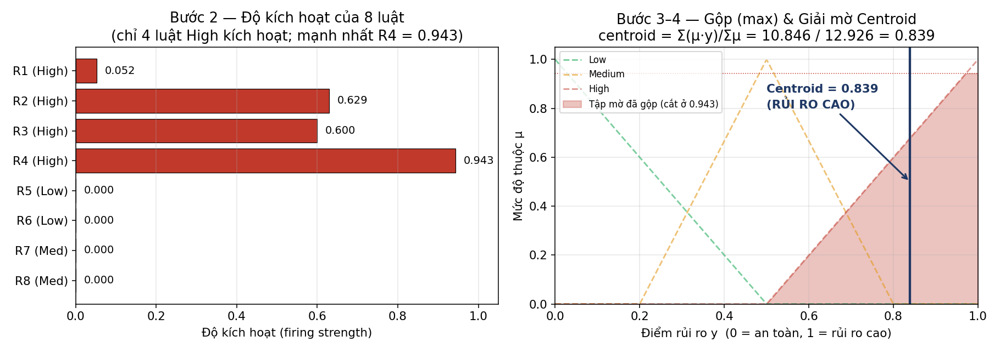
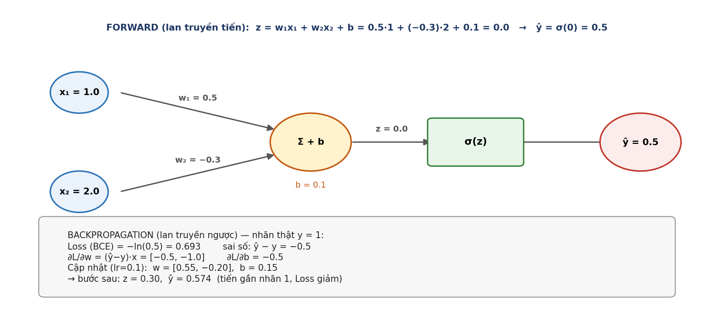

# Giải thích thuật toán kèm ví dụ tính từng bước

Dự án dùng 2 thuật toán cốt lõi. Tài liệu này giải thích rõ và **tính tay từng
bước bằng số cụ thể** cho mỗi thuật toán:

- **A. Hệ suy diễn mờ Mamdani** — biến đặc trưng một lượt đăng nhập thành 1 điểm rủi ro.
- **B. Huấn luyện MLP** — cơ chế Forward Propagation & Backpropagation.

> **Mỗi bước đều ghi rõ hàm nào, nằm ở file nào** — để khi cô hỏi "chỗ đó em code ở đâu?"
> thì mở đúng file ngay. Toàn bộ mã nguồn ở `rba_local_project/src/`.
>
> Mọi con số trong tài liệu đã được **kiểm chứng bằng cách chạy lại chính code của dự án**.

## Bản đồ code cho tài liệu này

| Phần | File | Hàm / lớp phụ trách |
|---|---|---|
| **A. Hệ mờ Mamdani** | `fuzzy_mamdani.py` | `triangular()`, `low_med_high()`, lớp `MamdaniFuzzyRiskSystem` (`fit()`, `_fuzzify()`, `_rule_base()`, `transform()`) |
| **B. Mạng MLP** | `model.py` | lớp `MLPClassifier` (`__init__()`, `forward()`), `train_mlp()`, `evaluate()`, `to_tensor()` |
| Hằng số của cả hai | `config.py` | `FUZZY_OUTPUT_GRID_POINTS`, `HIDDEN_DIMS`, `DROPOUT`, `LEARNING_RATE`, `EPOCHS`, `EARLY_STOPPING_PATIENCE` |

---

## A. Hệ suy diễn mờ Mamdani — ví dụ cho ra điểm 0.8391

> 📁 **Toàn bộ phần A nằm ở `fuzzy_mamdani.py`.** Bốn bước bên dưới được cài đặt trong
> lớp `MamdaniFuzzyRiskSystem` (cùng file).

**Mục tiêu:** từ đặc trưng của một lượt đăng nhập → một điểm rủi ro trong [0, 1].
Hệ chạy qua 4 bước: Fuzzification → Rule Evaluation → Aggregation → Defuzzification.

**Toán tử mờ:** AND = `min`, OR = `max`, NOT = `1 − μ`.

**Bốn bước ↔ hàm cài đặt** (đều trong `fuzzy_mamdani.py`):

| Bước | Tên tiếng Anh | Hàm / phương thức cài đặt |
|---|---|---|
| 1 | Fuzzification (mờ hóa) | `_fuzzify()` → gọi `low_med_high()` → gọi `triangular()` |
| 2 | Rule Evaluation (đánh giá luật) | `_rule_base()` (chứa 8 luật), gọi từ `transform()` |
| 3 | Aggregation (gộp bằng max) | `transform()` |
| 4 | Defuzzification (Centroid) | `transform()` |

Ngưỡng dùng để mờ hóa được học trước đó bởi phương thức `fit()` (cùng file), chỉ chạy
trên **tập train** — xem `GiaiThich_Data_TienXuLy.md` mục 6.2.

### Dữ liệu ví dụ (một lượt đăng nhập rủi ro cao)

| Đặc trưng | Giá trị / tình huống |
|---|---|
| Quốc gia | Mới (khác lần trước) → `is_new_country = 1` |
| ASN (nhà mạng) | Mới → `is_new_asn = 1`, và rất hiếm |
| Thời gian từ lần đăng nhập trước | Rất lâu (gap lớn) |
| Tỉ lệ đăng nhập thành công trước đó | Thấp |
| Số thứ thay đổi (thiết bị/trình duyệt/OS…) | Nhiều |

> Các đặc trưng đầu vào này do `engineer_features()` và `apply_global_stats()` sinh ra —
> **cả hai ở `features.py`** (không phải `fuzzy_mamdani.py`).

### Bước 1 — Fuzzification (mờ hóa)

> 📁 **Hàm:** `_fuzzify()` gọi `low_med_high()`, hàm này gọi `triangular()` —
> **cả ba trong `fuzzy_mamdani.py`**.

Mỗi biến liên tục được đưa về mức độ thuộc Low/Medium/High bằng hàm tam giác
(ngưỡng học từ phân vị 20/50/80 của tập train, do `fit()` học). Với mẫu trên, ta thu
được các mức độ thuộc (μ) cần dùng:

| Mức độ thuộc | Giá trị μ |
|---|---|
| `gap_high` (lâu không đăng nhập) | 0.052 |
| `asn_rarity_high` (ASN hiếm) | 0.943 |
| `success_low` (tỉ lệ thành công thấp) | 0.629 |
| `num_changes_high` (đổi nhiều thứ) | 0.600 |
| `is_new_country`, `is_new_asn` | 1.0 ; 1.0 |

*Lưu ý:* `is_new_country` và `is_new_asn` vốn đã là cờ 0/1 nên **không cần mờ hóa** —
chúng được dùng trực tiếp trong luật (xem `_rule_base()`).

### Bước 2 — Rule Evaluation (tính độ kích hoạt từng luật)

> 📁 **Hàm:** `_rule_base()` trong `fuzzy_mamdani.py` — chứa nguyên văn 8 luật; được
> `transform()` (cùng file) gọi.

Áp 8 luật IF-THEN, dùng `min` cho AND và `max` cho OR:

| Luật | Công thức | Tính | Kết quả (firing) | Hệ quả |
|---|---|---|---|---|
| R1 | min(is_new_country, is_new_asn, gap_high) | min(1, 1, 0.052) | **0.052** | High |
| R2 | success_low | 0.629 | **0.629** | High |
| R3 | num_changes_high | 0.600 | **0.600** | High |
| R4 | asn_rarity_high | 0.943 | **0.943** | High |
| R5 | min(NOT new_country, …) | có thừa số = 0 | 0.000 | Low |
| R6 | min(gap_low, country_rarity_low) | ≈ 0 | 0.000 | Low |
| R7 | max(changes_med, gap_med) | ≈ 0 | 0.000 | Medium |
| R8 | min(success_med, …) | ≈ 0 | 0.000 | Medium |

→ Chỉ 4 luật hệ quả **High** kích hoạt; Low và Medium đều bằng 0.

### Bước 3 — Aggregation (gộp bằng max)

> 📁 **Hàm:** `transform()` trong `fuzzy_mamdani.py` — hai dòng
> `np.minimum(...)` (cắt phẳng) và `np.maximum(aggregated, clipped, out=aggregated)` (gộp).

Mỗi luật "cắt phẳng" tập mờ đầu ra của nó tại độ kích hoạt, rồi gộp tất cả bằng
`max`. Vì R1–R4 cùng cho **High**, tập kết quả là tập mờ `High` bị cắt ngang tại
độ kích hoạt lớn nhất:

```
mức cắt = max(0.052, 0.629, 0.600, 0.943) = 0.943
```

Ba tập mờ đầu ra được định nghĩa sẵn làm thuộc tính của lớp `MamdaniFuzzyRiskSystem`
(trong `fuzzy_mamdani.py`):

```python
# fuzzy_mamdani.py — thuộc tính của lớp MamdaniFuzzyRiskSystem
OUT_LOW  = triangular(Y_GRID, 0.0, 0.0, 0.5)
OUT_MED  = triangular(Y_GRID, 0.2, 0.5, 0.8)
OUT_HIGH = triangular(Y_GRID, 0.5, 1.0, 1.0)
```

Tập mờ `High` là tam giác vai phải: μ(y) = (y − 0.5) / 0.5 với y ∈ [0.5, 1.0].
Cắt ngang tại μ = 0.943 nghĩa là:
- Với y ∈ [0.5 , 0.9715] : μ(y) = (y − 0.5)/0.5 (phần dốc lên)
- Với y ∈ [0.9715 , 1.0] : μ(y) = 0.943 (phần bị cắt phẳng)

(0.9715 = 0.5 + 0.943 × 0.5 là điểm mà đường dốc chạm mức 0.943.)

### Bước 4 — Defuzzification (Centroid — lấy trọng tâm)

> 📁 **Hàm:** `transform()` trong `fuzzy_mamdani.py` — ba dòng cuối
> (`numerator`, `denominator`, `np.divide(...)`). Số điểm lưới là hằng số
> `FUZZY_OUTPUT_GRID_POINTS = 51` khai báo ở **`config.py`**.

Quy tập mờ đã gộp về **một con số** bằng công thức trọng tâm, rời rạc hóa miền
[0, 1] thành lưới 51 điểm (`Y_GRID = np.linspace(0, 1, 51)`):

```
             Σ μ(y)·y
centroid = ──────────
              Σ μ(y)
```

Thay số (tính trên 51 điểm của lưới):

```
Tử số   Σ μ(y)·y = 10.8463
Mẫu số  Σ μ(y)   = 12.9260

centroid = 10.8463 / 12.9260 = 0.8391
```

→ **Điểm rủi ro = 0.839** (> 0.5) ⇒ lượt đăng nhập này **rủi ro cao**. Điểm này
(cùng 15 mức độ thuộc) được đưa vào MLP làm đặc trưng, **không phải quyết định cuối**.

*Chi tiết cài đặt:* `transform()` trả về DataFrame gồm 16 cột — 15 cột `fz_*` (mức độ
thuộc) và 1 cột `mamdani_risk_score` (điểm centroid). Tên 16 cột này liệt kê ở hằng số
`FUZZY_FEATURE_COLUMNS`, cũng trong `fuzzy_mamdani.py`. Chúng được ghép vào vector đầu
vào 39 chiều tại `prepare_splits()` — **`dataset_prep.py`**.

*Trường hợp biên:* nếu tất cả 8 luật đều không kích hoạt (mẫu số ≈ 0), `transform()` trả
về mặc định **0.5** (trung tính) thay vì lỗi chia cho 0 — xem tham số
`out=np.full(n, 0.5)` trong lệnh `np.divide`.



*Hình A — Trái: độ kích hoạt của 8 luật (chỉ 4 luật High kích hoạt, mạnh nhất R4 = 0.943). Phải: gộp tập mờ High (cắt ngang ở 0.943) rồi lấy trọng tâm (centroid) = 0.839.*

---

## B. Huấn luyện MLP — ví dụ Forward & Backpropagation (1 mẫu)

> 📁 **Toàn bộ phần B nằm ở `model.py`.** Kiến trúc mạng ở lớp `MLPClassifier`; vòng lặp
> huấn luyện (4 bước bên dưới) ở hàm `train_mlp()`; đánh giá ở `evaluate()` — **cùng file**.

MLP học theo 4 bước, lặp qua nhiều epoch. Dưới đây minh họa **một nơ-ron đầu ra**
với 2 đặc trưng để thấy rõ phép tính; mạng nhiều tầng lặp lại đúng nguyên lý này
và dùng quy tắc chuỗi (chain rule) để lan truyền ngược qua các tầng.

**Bốn bước ↔ dòng code trong `train_mlp()`** (`model.py`):

| Bước | Việc | Dòng code tương ứng |
|---|---|---|
| B1 | Khởi tạo | `model = MLPClassifier(input_dim)` — lớp ở cùng file |
| B2 | Forward | `model(xb)` → gọi `MLPClassifier.forward()` |
| B3 | Loss + Backprop | `loss = criterion(model(xb), yb)` rồi `loss.backward()` |
| B4 | Cập nhật tham số | `optimizer.step()` (Adam) |

### Dữ liệu ví dụ

- Một mẫu, 2 đặc trưng (đã chuẩn hóa): **x = [1.0 , 2.0]**
- Nhãn thật: **y = 1** (là tấn công)
- Khởi tạo: **w = [0.5 , −0.3]**, **b = 0.1**, learning rate **lr = 0.1**

### B1 — Khởi tạo
Đã có w, b, lr ở trên.

> 📁 Trong dự án thật, việc khởi tạo do PyTorch tự làm khi tạo `MLPClassifier(input_dim)`
> — lớp này định nghĩa ở `model.py`, dùng `nn.Linear` (PyTorch). Kích thước 3 tầng ẩn lấy
> từ hằng số `HIDDEN_DIMS = (128, 64, 32)` ở **`config.py`**; `lr` lấy từ
> `LEARNING_RATE = 1e-3` (cũng `config.py`).

### B2 — Forward Propagation (lan truyền tiến)

> 📁 **Hàm:** `MLPClassifier.forward()` trong `model.py` (chỉ 1 dòng:
> `return self.net(x).squeeze(-1)` — trả về *logit*, chưa qua sigmoid).

```
z = w·x + b = 0.5×1.0 + (−0.3)×2.0 + 0.1 = 0.5 − 0.6 + 0.1 = 0.0
ŷ = σ(z) = 1 / (1 + e^0) = 0.5          (xác suất tấn công dự đoán)
```

*Chú ý một chi tiết cài đặt:* `forward()` **không** áp sigmoid — nó trả về logit thô.
Sigmoid được áp riêng: trong `train_mlp()` thì nằm sẵn trong `BCEWithLogitsLoss` (ổn định
số học hơn), còn khi cần xác suất để đánh giá/suy luận thì gọi `torch.sigmoid()` — thấy ở
`evaluate()` (`model.py`) và `predict_risk()` (`inference.py`).

### B3 — Tính Loss & Gradient (Backpropagation)

> 📁 **Trong `train_mlp()`** (`model.py`): `criterion = nn.BCEWithLogitsLoss(pos_weight=...)`
> rồi `loss.backward()`. `BCEWithLogitsLoss` là của **PyTorch**, không phải nhóm tự viết.

```
Loss (BCE) = −[ y·ln(ŷ) + (1−y)·ln(1−ŷ) ]
           = −[ 1·ln(0.5) + 0 ] = 0.693

Sai số:  error = ŷ − y = 0.5 − 1 = −0.5

∂L/∂w = error · x = −0.5 × [1.0 , 2.0] = [−0.5 , −1.0]
∂L/∂b = error       = −0.5
```

*Vì sao `∂L/∂z = ŷ − y` gọn như vậy?* Vì đạo hàm của BCE kết hợp với sigmoid triệt tiêu
lẫn nhau — đây là lý do người ta luôn ghép cặp sigmoid + BCE, và cũng là lý do PyTorch
gộp chúng vào một hàm `BCEWithLogitsLoss`.

### B4 — Cập nhật tham số (Gradient Descent)

> 📁 **Trong `train_mlp()`** (`model.py`): `optimizer.step()`. Dự án dùng **Adam** (một
> biến thể thông minh hơn của gradient descent) chứ không phải SGD thuần; ví dụ dưới đây
> minh họa bằng gradient descent cơ bản cho dễ hiểu nguyên lý.

```
w mới = w − lr·∂L/∂w = [0.5, −0.3] − 0.1×[−0.5, −1.0] = [0.55 , −0.20]
b mới = b − lr·∂L/∂b = 0.1 − 0.1×(−0.5)               = 0.15
```

### Kiểm chứng (một bước đã tiến đúng hướng)

Tính lại với tham số mới:

```
z mới = 0.55×1.0 + (−0.20)×2.0 + 0.15 = 0.30
ŷ mới = σ(0.30) = 0.574
```

Dự đoán tăng từ **0.5 → 0.574**, tiến gần nhãn thật (y = 1) ⇒ Loss giảm. Lặp lại
B2 → B3 → B4 cho tất cả mẫu, qua nhiều epoch, mô hình sẽ hội tụ.



*Hình B — Lan truyền tiến (trên): x → nhân trọng số → cộng bias → sigmoid → ŷ. Lan truyền ngược (dưới): tính Loss, gradient và cập nhật w, b; sau một bước ŷ tiến gần nhãn thật.*

### Từ ví dụ 1 nơ-ron đến mạng thật trong dự án

> 📁 Kiến trúc: lớp `MLPClassifier.__init__()` trong `model.py`.

| Thành phần | Ví dụ trên | Mạng thật trong dự án | Khai báo ở |
|---|---|---|---|
| Đầu vào | 2 đặc trưng | **39 chiều** | ghép ở `prepare_splits()` — `dataset_prep.py` |
| Tầng ẩn | không có | **3 tầng: 128 → 64 → 32** | `HIDDEN_DIMS` — `config.py` |
| Mỗi tầng ẩn gồm | — | `Linear` → `ReLU` → `BatchNorm` → `Dropout(0.3)` | `MLPClassifier` — `model.py`; `DROPOUT` — `config.py` |
| Tầng ra | 1 nơ-ron | **1 logit** | `MLPClassifier` — `model.py` |
| Hàm mất mát | BCE cơ bản | `BCEWithLogitsLoss` + `pos_weight` (bù lệch lớp ~3%) | `train_mlp()` — `model.py` |
| Bộ tối ưu | GD cơ bản | **Adam**, lr = 1e-3 | `train_mlp()` — `model.py`; `LEARNING_RATE` — `config.py` |
| Số epoch | 1 bước | tối đa **30**, dừng sớm nếu Val AUPRC không cải thiện sau **5** epoch | `EPOCHS`, `EARLY_STOPPING_PATIENCE` — `config.py` |

Backpropagation trong mạng nhiều tầng vẫn theo đúng nguyên lý ví dụ trên: tính
`∂L/∂z = ŷ − y` ở tầng ra, rồi lan truyền ngược qua từng tầng bằng **chain rule**. Trong
code không phải viết tay phần này — PyTorch tự động tính khi gọi `loss.backward()` trong
`train_mlp()` (`model.py`).

---

## Tóm tắt: bước nào ở file nào

| Việc | Hàm | File |
|---|---|---|
| Học ngưỡng phân vị + min/max cho hệ mờ | `MamdaniFuzzyRiskSystem.fit()` | `fuzzy_mamdani.py` |
| Hàm thuộc tam giác | `triangular()` | `fuzzy_mamdani.py` |
| Dựng 3 mức Low/Med/High | `low_med_high()` | `fuzzy_mamdani.py` |
| Bước 1: Mờ hóa | `_fuzzify()` | `fuzzy_mamdani.py` |
| Bước 2: 8 luật IF–THEN | `_rule_base()` | `fuzzy_mamdani.py` |
| Bước 3 + 4: Gộp mờ & Centroid | `transform()` | `fuzzy_mamdani.py` |
| Ghép 16 đặc trưng mờ vào vector 39 chiều | `prepare_splits()` | `dataset_prep.py` |
| Kiến trúc mạng MLP | `MLPClassifier` | `model.py` |
| Forward | `MLPClassifier.forward()` | `model.py` |
| Vòng lặp huấn luyện (loss, backprop, cập nhật) | `train_mlp()` | `model.py` |
| Đánh giá (AUROC, AUPRC, Precision, Recall, F1) | `evaluate()` | `model.py` |
| Suy luận trên dữ liệu mới | `predict_risk()` | `inference.py` |
| Chạy toàn bộ quy trình | `main()` | `train.py` |
